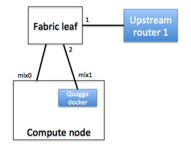
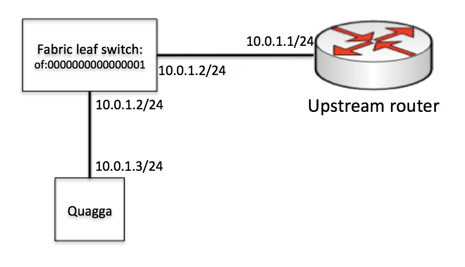

# Connecting to Upstream Networks using vRouter

A CORD POD needs to be connected to an upstream network to provide connectivity from within CORD to the outside world. The vRouter service in CORD is designed to enable the CORD POD to communicate with upstream routers and provide this connectivity. Currently the vRouter supports BGP for communicating routes to and from upstream routers.

Each deployment is different in terms of protocols and features required, so this guide aims to be a general overview of how to set up CORD to communicate with external routers. The operator will have to customize the configurations to be appropriate for their deployment.

Deploying the vRouter infrastructure is a relatively manual process right now. The intention is that over time the process will become more automated and easier to perform.

## Prerequisites

This guide assumes that you have run through the POD install procedure outlined [here](quickstart_physical.md). You must also have installed and configured the fabric ONOS cluster and connected the fabric switches to that controller.

## Physical Connectivity

External routers must be physically connected to one of the fabric leaf switches. It is possible to connect to multiple routers, but currently there is a limitation that they must all be physically connected to the same leaf switch, and the Quagga instance must be connected to the same fabric switch as the upstream routers.



## Dedicating a Fabric Interface for Quagga

The CORD build process determines which NICs on each compute node are connected to the fabric and puts these NICs into a bonded interface. The name of this bond is fabric, so if you run `ifconfig` on the compute node you have selected to deploy Quagga, you should see this bonded interface appear in the output.

```
ubuntu@fumbling-reason:~$ ifconfig fabric
fabric    Link encap:Ethernet  HWaddr 00:02:c9:1e:b4:e0
          inet addr:10.6.1.2  Bcast:10.6.1.255  Mask:255.255.255.0
          inet6 addr: fe80::202:c9ff:fe1e:b4e0/64 Scope:Link
          UP BROADCAST RUNNING MASTER MULTICAST  MTU:1500  Metric:1
          RX packets:1048256 errors:0 dropped:42 overruns:0 frame:0
          TX packets:0 errors:0 dropped:0 overruns:0 carrier:0
          collisions:0 txqueuelen:0
          RX bytes:89101760 (89.1 MB)  TX bytes:0 (0.0 B)
```
          
We need to dedicate one of these fabric interfaces to the Quagga container, so we'll need to remove it from the bond. You should first identify the name of the interface that you want to dedicate. In this example we'll assume it is called mlx1. You can then remove it from the bond by editing the /etc/network/interfaces file:

```
sudo vi /etc/network/interfaces
```

You should see a stanza that looks like this:

```
auto mlx1
iface mlx1 inet manual
    bond-master fabric
```
    
Simply remove the line `bond-master fabric`, save the file then restart the networking service on the compute node.

## L3 setup

The operator will need to allocate a subnet that exists between the CORD POD and the upstream router that is used for peering between the CORD Quagga instance and the upstream routers. CORD currently has a limitation that it requires 2 IP addresses in the peering subnet, so for 1 upstream router we need to allocate 3 addresses in total. This means the peering subnet cannot be smaller than a /29.

The CORD fabric requires 2 IP addresses so that it can separate peering traffic from data traffic. Peering happens using one of the IP addresses, and the routes in the POD are advertised upstream with the next-hop set to the other IP address. This menas that when traffic comes to the fabric leaf switch from outside, the switch is able to distinguish peering traffic from data traffic and treat each appropriately.

An example of how this is configured is shown in the following figure:



In this case the peering subnet is `10.0.1.0/24`. The upstream router is using the `10.0.1.1` address. The CORD Quagga is assigned `10.0.1.3`, which is the address used for peering. The upstream router needs to be configured with `10.0.1.3` as its BGP neighbor, and the BGP peering will be established between `10.0.1.1` and `10.0.1.3`.

The `10.0.1.2` address is used by the fabric switch and for the next-hop for routes advertised by the CORD POD.

Of course you are not obliged to use `10.0.1.0/24`, you should use a subnet that makes sense for your peering environment

## Install and Configure vRouter on ONOS
The vRouter will be run on the `onos-fabric` cluster that controls the physical fabric switches. 

### Interface Configuration

Each Quagga-Router pair needs to have interface configuration for the interfaces where the Quagga and upstream router are attached to the fabric. This is where we configure the second IP address that we allocated from the peering subnet. The following shows a configuration example:

```
{
    "ports" : {
        "of:0000000000000001/1" : {
            "interfaces" : [
                {
                    "name" : "upstream1",
                    "ips"  : [ "10.0.1.2/24" ],
                    "vlan-untagged" : 4000
                }
            ]
        },
        "of:0000000000000001/2" : {
            "interfaces" : [
                {
                    "name" : "quagga",
                    "ips"  : [ "10.0.1.2/24" ],
                    "vlan-untagged" : 4000
                }
            ]
        }
    }
}
```

* name - an arbitrary name string for the interface
* ips - configure the second IP from the peering subnet. This will be the same IP address on both the quagga and upstream interfaces.
* vlan-untagged - configure the same VLAN ID on both interfaces. It doesn't matter exactly what the VLAN ID is, but it must be the same on both the quagga-facing and upstream-facing interfaces.

This configuration will set up an L2 link between the two fabric switch ports, over which the Quagga and external router can communicate.

The interface configuration can be added to the `/opt/cord_profile/fabric-network-cfg.json` on the head node which contains the initial fabric configuration. Then you can run the following command to refresh the configuration in ONOS:

```
docker-compose -p rcord exec xos_ui python /opt/xos/tosca/run.py xosadmin@opencord.org /opt/cord_profile/fabric-service.yaml
```

### Restart the applications

If the segment routing application is already running, it will need to be restarted so that it will notice the new interface configuration.

The `onos-fabric` CLI can be accessed with the following command run on the head node:

```
$ ssh karaf@onos-fabric -p 8101
```

On the `onos-fabric` CLI, deactivate and reactivate segment routing:

```
onos> app deactivate org.onosproject.segmentrouting
onos> app activate org.onosproject.segmentrouting
```

The `org.onosproject.fpm` application is also needed, and it should be already running after the initial install. Double-check that it is running, and if not activate it.

## Deploy the Quagga Docker Image

### Download the image and pipework

CORD uses a slightly modified version of Quagga, so the easiest way to deploy this is to use the provided docker image.

```
docker pull opencord/quagga
```

We also need to download the `pipework` tool which will be used to connect the docker image to the physical interface that we set aside earlier.

```
wget https://raw.githubusercontent.com/jpetazzo/pipework/master/pipework
chmod +x pipework
```

Create a directory for your Quagga configuration files, and create a `bgpd.conf` and `zebra.conf` in there. More on configuring Quagga later.

```
mkdir configs
```

Now run the docker image (make sure the path the config directory matches what is on your system):

```
sudo docker run --privileged -d -v configs:/etc/quagga -n quagga opencord/quagga
```

Finally, we can use the pipework tool to add the physical interface into the container so that Quagga can talk out over the fabric:

```
sudo ./pipework mlx1 -i eth1 quagga 10.0.1.3/24
```

This will add host interface `mlx1` to the container with name `quagga` with interface name `eth1` inside the container. The newly added interface will have the IP `10.0.1.3`. This IP address should be the peering subnet address that you want to assign to Quagga.

If you need to change anything about the container (for example if you change the Quagga configuration) you can remove the original container and run a new one:

```
docker rm -f quagga
sudo docker run --privileged -d -v configs:/etc/quagga -n quagga opencord/quagga
```

## Configure Quagga

At this point Quagga should have IP connectivity to the external routers, and it should be able to ping them on the peering subnet.

Now Quagga and the upstream routers can be configured to peer with one another. This configuration of Quagga is going to be highly dependent on the configuration of the upstream network, so it won't be possible to give comprehensive configuration examples here. It is recommended to consult the [Quagga documentation](http://www.nongnu.org/quagga/docs/docs-info.html) for exhaustive information on Quagga's capabilities and configuration. Here I will attempt to provide a few basic examples of Quagga configuration to get you started. You'll have to enhance these with the features and functions that are needed in your network.

### Zebra Configuration

Regardless of which routing protocols you are using in your network, it is important to configure Zebra's FPM connection to send routes to the vRouter app running on ONOS. This feature was enabled by the patch that was applied earlier when we installed Quagga.

A minimal Zebra configuration might look like this:

```
!
hostname cord-zebra
password cord
!
fpm connection ip 10.6.0.1 port 2620
!
```
The FPM connection IP address is the IP address of one of the `onos-fabric` cluster instance that is running the vRouter app.

If you have other configuration that needs to go in zebra.conf you should add that here as well.

### BGP configuration

An example simple BGP configuration for peering with one BGP peer might look like this:


```
hostname bgp
password cord
!
ip prefix-list 1 seq 10 permit 192.168.0.0/16
!
route-map NEXTHOP permit 10
match ip address prefix-list 1
set ip next-hop 10.0.1.2
!
router bgp 65535
  bgp router-id 10.0.1.3
  !
  network 192.168.0.0/16
  !
  neighbor 10.0.1.1 remote-as 65535
  neighbor 10.0.1.1 description upstream1
  neighbor 10.0.1.1 route-map NEXTHOP out
  !
```

This configuration peers with one upstream router (`10.0.1.1`) and advertises one route (`192.168.0.0/16`).

Pay attention to the configuration to rewrite the next hop of routes that are advertised to the upstream router. A route-map is used to set the next hop of advertised routes to `10.0.1.2`, which is different from the address that Quagga is using to peer with the external router. As mentioned above, it is important that this rewriting is done correctly so that the fabric switch is able to distinguish data plane and control plane traffic.

